# 🚀🚀🚀My Internship Log🚀🚀🚀

This document is my personal log. It shows/documents my journey with the immersive insiders team and my personal development.

Most important is not a lot of text, but very concentrated text that explains the **essence** of what I did/tried/learned/discovered!!!

## Week 1 2021-03-01

### ✅My Tasks
- Create/search a phone/scanning image
    - Create an animation from it in Unity
- Learning about branching and git flow
- Solid Principles   

### 📚What I learned
- There is this website [TheNounProject](https://thenounproject.com/)
    - it offers a whole world of nice high-quality icons
    - I should keep in mind to credit the author otherwise it is "stealing”.

- Git
    - Git Workflow
        -  Use 'git status' to check for current status of files - it will highlight the modified files in red.
        - Use 'git add' to add the files which have to committed and pushed, add only the files that were edited.
        - Use 'git commit -m "some text" ' to commit your changes, before committing make sure to add a short note using -m " " ,note should mention what modification one has made
        - Use 'git push' to finally push it to your repo in the server.
    - If credentials of a git user already exit , it can be easily changed by 
        - Type  " git config --global --user " . Which will open the following screen?
        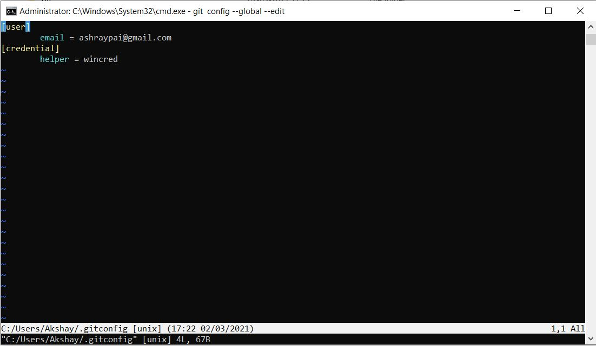 
        - At the bottom you can see the path at which the config file is located 
        - Navigate to that path, open the file and enter your git email.
        - Whola ! it's done !

- Blender [Need to work on this in the future after getting my VR headset]
    - We can render blender models into VR Devices directly to see the preview.
    - Following are the simple steps as to how that feature can be enabled
        1. Edit -> Preferences -> Add-ons
        2. Search for VR and ☑ check the box for "3D View: VR Scene Inspection”.
        3. In 3D View , select View tab and choose your VR Camera
        4. In 3D View , select VR tab and click on Start VR Session
        
        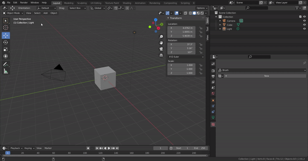 

- Unity Programming
    - Learnt to use Invoke function 
        - I wanted to delay the start of my game by few seconds, I thought I could use coroutines and make the function to wait for few seconds, but that logic does not work , because in coroutines the function is already executed , it returns void.
        - After some researching, I found out about *Invoke* Function, using this you can invoke a function after a certain time duration. This solved my problem. 
        - Syntax : Invoke("Function_name_in_form_of_staring", delay_duration)
    

- Programming Principles 
    - Learnt the S O L I D , principles 

### 🛠Created
- Tried with this image 
 

    *author: Hand Phone by Jonathan Wnty from the Noun Project*

- But since my game required to hold the phone with both hands, I changed it to the below image 

*author: hands holding smartphone by Atif Arshad from the Noun Project*

This is how it looks after animation: 

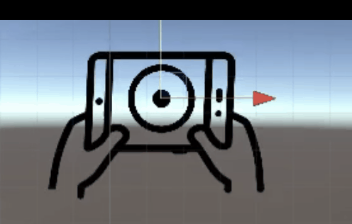 

Version 2 :

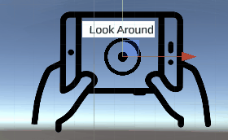 

-------------------------------------

## Week 2 2021-03-08

**USE BRANCHING FOR WEEK 2!!! create a branch which is named log-update/week-2**...

...and add your changes for week two in it, next Monday we are going to review the branch and merge it into main”.

### ✅My Tasks
 - Learning about branching and git flow
- Solid Principles   

### 📚What I learned
- Formatting text in TextMesh Pro
    - For my game I had the credits canvas and I wanted  it to look clean and neat.
    - Initially I tried formatting it in a word document and pasting it in the unity's text box but realized that it does not work that way!
    - After looking up for it in google I found this website :
    [Digital Native Studios](http://digitalnativestudios.com/textmeshpro/docs/)
    - It has documented all the different type of formatting that can be done using TextMesh Pro.
    - I learnt to use the tags, they were similar to a HTML tags.
    - I learnt how to download sprite sheet, use the sprite editor to split it and use the tags in TextMesh pro to display the sprite as emojis.
    
    - Basically, to represent the words "VISUAL" and "MUSIC" as icons, highlighted in yellow box below.
    
    -  And what you see below is me using those features to modify the text as per my requirement.
        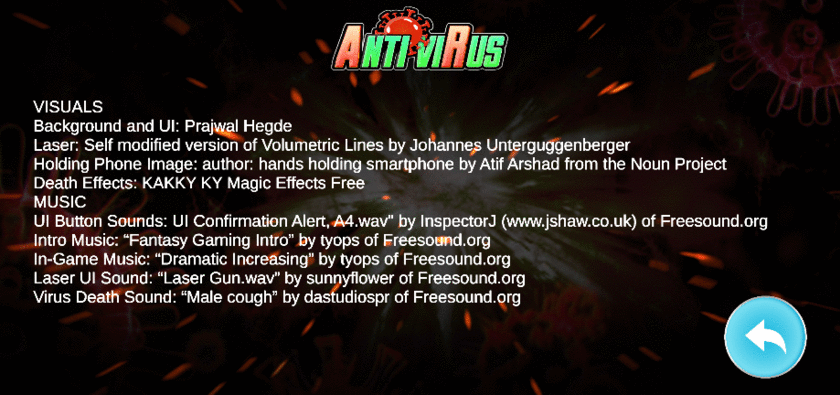 

- Git 
    - Learnt how branching is done, below is the correct flow of commands that has to be followed.
        - Check for status, add the edited files , commit and push to your main i.e., the forked repository also called as origin 
        - Go to git hub and Merge the pull request from the upstream.
        - Now the upstream content will be merged to your main 
        - Pull this main into your local drive.
        - Create a branch for this using the command "git branch log-update/week-2”.  
        -Now that your branching is complete in your local and to see the same in you GitHub, you can check for status, it will show which branch you are i
        n and then if there is nothing to commit proceed to push it.
        - Now that we have a branch ,to push it is always a good practice to mention the path where it has to be pushed to, so for my case the command looks like : git push origin log-update/week-2

- Blender
    - Learnt how to add textures and material to 3D models.
    - I attempted to add the material and textures, but when I exported it and imported it in unity the textures were missing.
    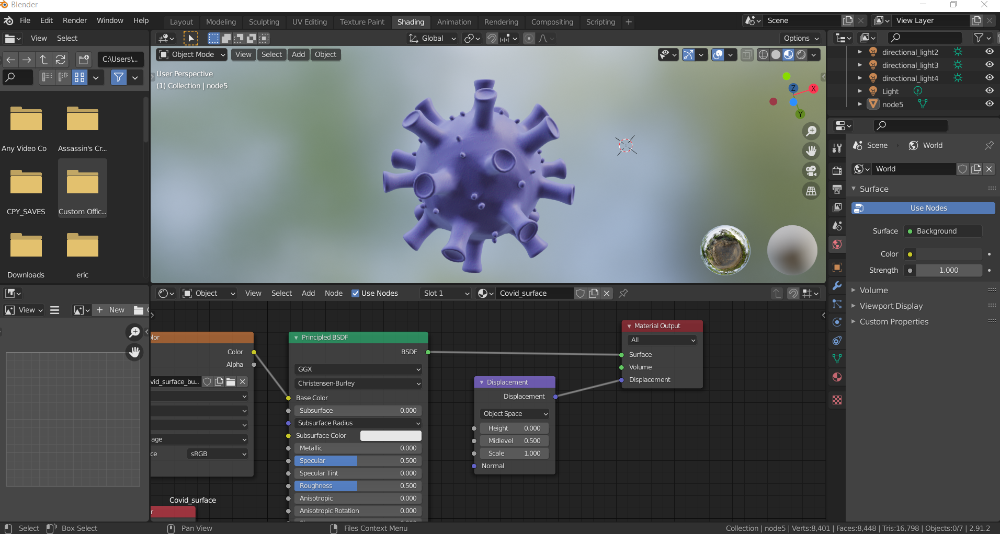 
    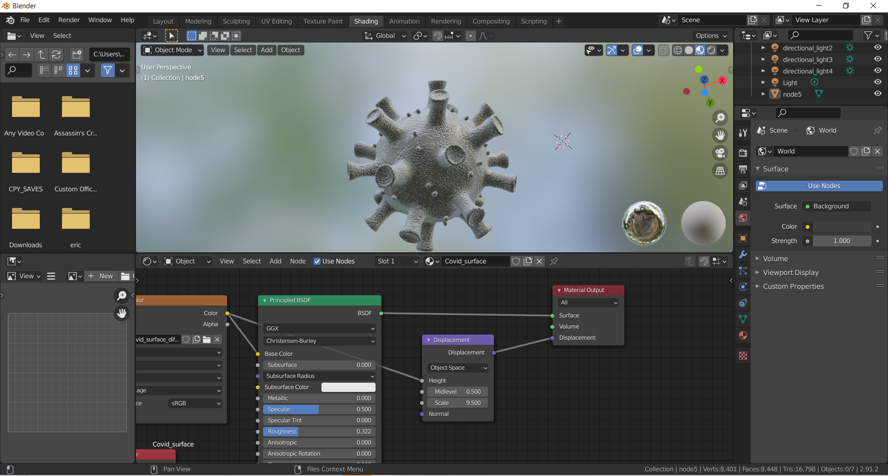  
    - So, need learn as to how a model should be correctly exported to unity.

- Unity
    - Optimization is important and today I learnt that the texture take up a lot of memory.
    - The size that shows up in your file explorer is the physical texture size and the size that shows up in unity editor is the Game memory size.
     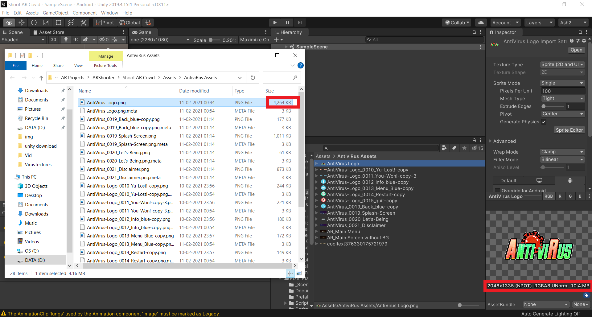 
     
     - If you want to save up the memory while the game is running you can decrease the max size in the editor
     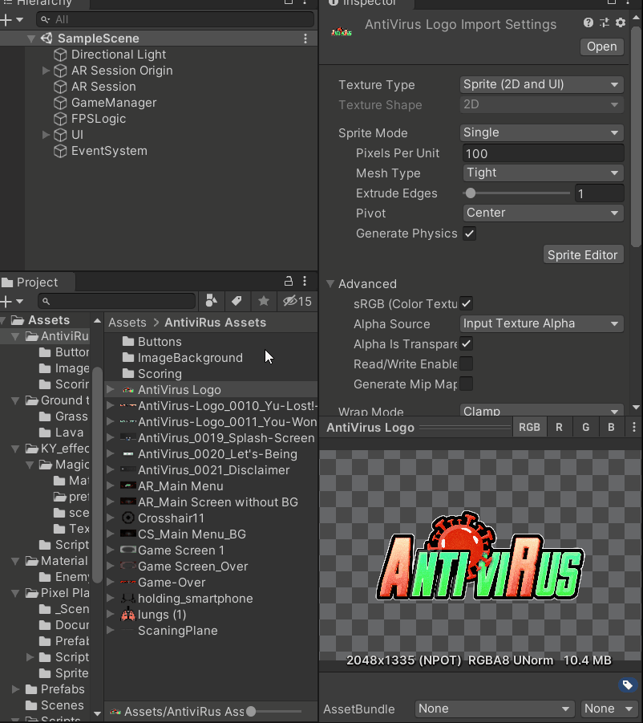 
     - I ended up saving a lot of memory 💾. As you can see above just by halving the size , the memory is reduced by 10X.  

### 🛠Created

- Created Virus model with different texture:
 

- As the texture was not imported from blender, the actual creation happened in unity editor this is how it looks: 

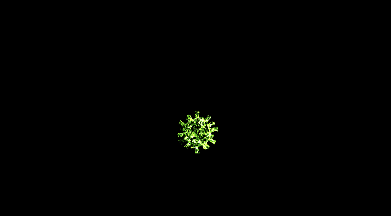 
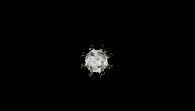 

- Sadly, they did not look that good when Augmented:

    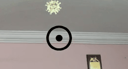
    
    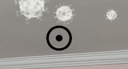

## Create github.io website from the log

- I have created my github.io but it’s not yet ready, I am yet to learn how to edit it and make it look good.
 - Here is the link :https://ashraypai.github.io/intern-log-template/
    

## Week 3 2021-03-15

### ✅My Tasks
- Helping with VR course
- Unity Design Principles
- Learning about particle effects in Unity  

### 📚What I learned
- Creating Augmented Reality Inside of Virtual Reality
    - We were able to create a model of tablet with camera and that would be able to use Ray-cast to detect images and spawn 3D objects.
    - The 3D model then could be pulled into VR by using events and changing the events

- Learnt to use the VFX graph in unity to create cool Particle effects.
    - Used the VFX graph to create the Fireworks with Immersive insider logo.
    - I referred to this video :https://www.youtube.com/watch?v=iCEHarLRCzI to create the basic rockets.
    - And then refer to this video : https://www.youtube.com/watch?v=r2Eoy3-p-xc&t=541s to create the 2D images as particle effects.

- Learnt to create 3D models in Blender
    - Used the add on from https://keentools.io/ 
    - Referred to the tutorials on their website and this video : https://www.youtube.com/watch?v=5WH7s-IPIeM to model my face in blender.

### 🛠Created

- Fireworks using particle effects and VFX Graph
    

- 3D model of my face , ( Yes! does not look like me, definitely needs improvement)
     

     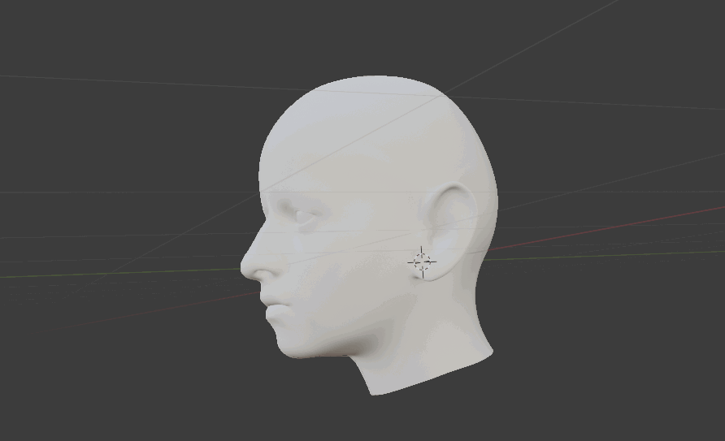

- Created Particle Effects out of that 3D model
    

## Week 4 2021-03-22

### ✅My Tasks
- Unity Design Patterns  
- Blog on AR Setup   
- Blog on Creating Fireworks effect using VFX Graph and Post Processing

### 📚What I learned
- Learnt the following Unity patterns :
    - Singleton
    - Object Pooling
    - Observer 
    - Component 
    - Flyweight
 

### 🛠Created

- The Blog on AR setup here in this link : https://github.com/ashraypai/BlogPosts/tree/master/AR%20Setup

- The Blog on VFX graph and Postprocessing can be found here in this link : https://github.com/ashraypai/BlogPosts/tree/master/VFX%20Graph

## Week 5 2021-03-29

### ✅My Tasks
- C# intermediate concepts 
- Blog on VR setup and XR Simulator Controls
- Snapchat Lens

### 📚What I learned
- Learnt the following concepts in C# :
    - Interface ✔
    - Inheritance ✔
    - Polymorphism 
    - Delegates 
    - Lamda expressions

 

- Learnt to use the Lens Studio software from Snpachat, to create AR lens. This software has accurate face, hand and body tracking. 
I have created 2 lenses, to try it, open snapchat and scan the below code.
    1. Immersive Trial :

        
    
    2. Immersive Cap:

        

### 🛠Created

- The Blog on VR setup and XR Simulator Controls, here in this link : https://github.com/ashraypai/BlogPosts/tree/master/VR%20Steup%20for%20using%20simulator

- Created Immersive Insider lens 

    1. Immersive Trail:

        

    2. Immersive Cap:

        

## Week 6 2021-04-05

### ✅My Tasks
- Setting up VR device for the course
- Creating feature for the course.
- Using shader graph to how out of boundary 

### 📚What I learned
- Learnt to setup HTC vive and required packages to use the controllers input for the interactions:
    - The XR interaction tool kit has to setup first, refer to this blog : VR setup and XR Simulator Controls
    - Click on Windows -> Package Manager -> Install OpenXR plugin, after installation, import the Controller from samples.
    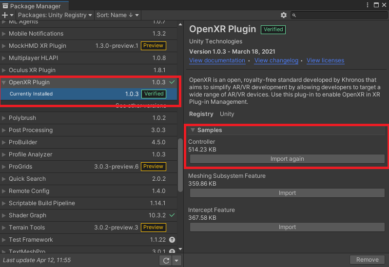
    - Go to file -> Build settings -> Player settings -> XR Plug-in Management and check the box ☑ for OpenXR.
    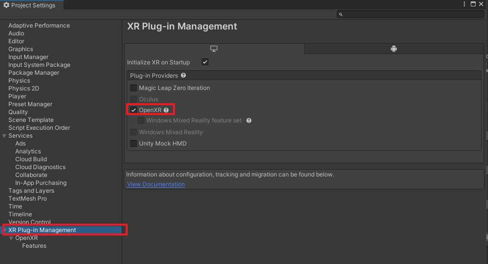
    -  In the same window, click on features under OpenXR and check the box ☑ for HTC Vive Controller Profile. 
    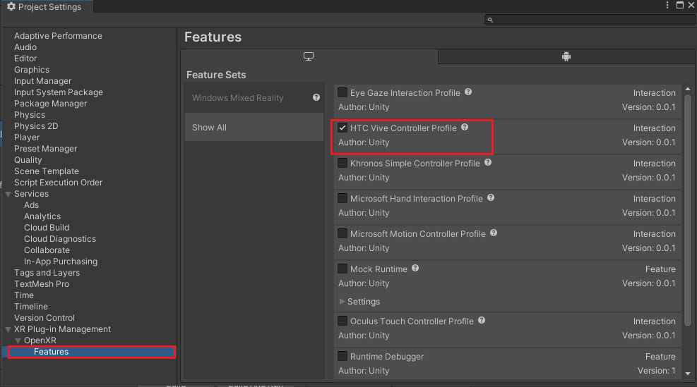

    With that HTC vive controllers can now be used to interact with the object in the scene. 

- Learnt to use shader graph to create a hologram effect:
    I learnt to use the shader graph from the following YouTube tutorials to create 2 holograms as a feature for the course: https://www.youtube.com/watch?v=wtZ5WcrV-9A  and https://www.youtube.com/watch?v=KGGB5LFEejg

- Attempted to recreate the out of boundary effect from Half-life Alyx using shader graph but I was unable to. However, I was able to obtain the same effect by using colliders.

    Key learning here for me was that for a good game design and programming we don't want to keep colliders and check for triggers all the time, instead if I am able to achieve it with shader graph it considered as a better design.

### 🛠Created

- The hologram effects:
    

- Out of boundary effect:
    

## Week 7 2021-04-12

### ✅My Tasks
- C# intermediate concepts.
- Selfie feature for the VR Course.
- Blog on the Simulator key bindings.[pending]

### 📚What I learned
- Learnt to use socket interaction for snapping the phone in place when the selfie stick's holder is close to it. Few points to remember is that for the socket interaction to work it requires a collider with "Is trigger" checked and also it better to have an attach transform , this will be the orientation taken by the game object when being interacted with. 

- Started to lean animation rigging. Idea is to a Body in VR. I learnt how to assign the bones and create joints.

- Learnt about a software called Fork, which is useful while using github. It makes the all the git-flow like adding, committing, pushing,etc a lot easier 
    

### 🛠Created

- Selfie stick dummy and then downloaded 3D asset from sketch fab . Credits : "Selfie Stick" (https://skfb.ly/6WT6V) by Mason is licensed under Creative Commons Attribution (http://creativecommons.org/licenses/by/4.0/).

## Week 8 2021-04-19

### ✅My Tasks
- Documentation of the features that I committed
- C# intermediate concepts[pending]
- Selfie Stick + hologram feature
- Research on Designing Great VR experience  

### 📚What I learned
- Every feature of a project needs to have a documentation, it captures all the things that was done apart from basic coding, below is the documentation for my hologram feature  :

    Hologram feature : 
    This feature uses shader graph to create an illusion of hologram, in particular its a hologram of immersive insiders and digital animal logo. It basically has 3 components, first is the tilting and offset with texture, which creates the effect of lines moving in on particular direction. Next is the fresnel effect,which creates the glowing effect around the hologram. The last component is flickering, which creates the effect of flickering objects.
    It uses simple code which activates, deactivates and rotates the hologram
- Leant on how correct usage of Interaction , Audio and visuals can increase the user experience in immersion. Motion sickness is something a developer has to keep in mind and ensure that user is made to feel comfortable at all times.The entire documentation of this can be found on [Notion](https://www.notion.so/dineshpunni/How-to-design-a-great-VR-experience-6b4b0f1e956a4be79b84bb3a4d38ee9c)

## Week 9 2021-04-26

### ✅My Tasks
- C# intermediate concepts [pending]
- Selfie Stick [pending]
- animation rigging [pending]
- XR simulator controls [pending] 
- Research on Designing Great VR experience  

### 📚What I learned
I learnt the theoretical part of developing a VR game/app. After some research I wrote a documentation that captures all the aspect that goes into developing a VR game. 
The documentation can be found in Notion, but here is the topics that I have covered :

1. Goal of the VR app : talk about having a goal for that app, determining target audience, possible problems.etc 

    1.1 End Goal

    1.2 Target Hardware

2. Interaction 

    2.1 Intractable objects : If something looks interactive, it has to be interactive. Detailing , scale of 3D objects

    2.2 UI of intractable objects : The hand grabbing the door, pressing button. some kind of cue to show that its intractable

    2.3 Gestures: Interaction based on gestures i.e making interaction as natural as possible .

    2.4 Gaze interaction 

    2.5 Interaction feedback: Using audio or haptic feedback when interaction are made. 

    2.6  Intractable Menu and its UI : keeping menu in 3D world and making them simple to use. 

3. Audio and Visual 

    3.1 Spatial Sound : Sound coming actual source , 3D sound (holophonic). Walking sound , interaction sound. Positional audio helps in guiding 

    3.2 Ambient sound : Sets the mood of the scene like calm, intense etc 

    3.3 Audio Source: Speakers vs Headphones

    3.4 Curved Canvas and Text: Better to use curved canvas for displaying text . Text font, style , max number of characters( do not keep long text)

    3.5 Visuals of 3D game objects and avatar : Should not be uncanny , better to have no avatar then avatar with unnatural movements. should not effect performance 

    3.6 Visual effects and animation: Visual effect techniques like isometrics, lighting, and shadows. Objects need to have appropriate animation 

4. Lighting 

    4.1 Types of lighting : Directional , point , spot light , etc

    4.2 Light Modes [Changed]

    4.3 Believable visuals: lighting strategy: Hemisphere lighting, direct and indirect lighting 

5. 3D Environment 

    5.1 Virtual Space : people can easily get uncomfortable in small, large, or high spaces (claustrophobia/agoraphobia/vertigo)

    5.2  Distance of 3D objects and menus: Keeping task at same level in depth 

    5.3  Comfort zone : “Goldilocks” zone, it’s best to keep interactive elements between desk height and eye level

    5.4  Encouraging hands position to be up: Hands are used for all interaction so gives more immersion 

    5.5 Relaxing environment : Repetitive patter can cause confusion , enable user to pause and save to relax, scenes that would automatically makes user feel relaxed. Avoid high contrast , harsh sound and extreme graphics 

    5.6 Transitioning scene: Smooth transition while change of scene, no sudden increase the brightness or vice versa

6. Motion sickness and prevention:  Why does it happen and how to avoid it

    6.0 Understanding the Cause

    6.1 Technical : FPS (judder), Poly count in scene , usage of materials and textures , pre-computed lighting 

    6.2  Locomotion : Teleportation vs continuous, No continuous rotation . If continuous use constant velocity with no acceleration 

    6.3 Field of view :  Continuous movement along with narrow FOV effect (vignetting)

    6.4 Motion to Photon Latency: Real time tracking and no latency from input to output

    6.5 Head Tracking :  Always maintain head tracking 

    6.6 Introducing fixed reference points: Like nose or horizon line that stays with user as they move

7. Immersion and Presence

    7.1 Spatial presence

    7.2 Flow

8. Rapid prototyping : To check got different features and select what suits the app best
9. Technical aspect of view in VR : Max degree of human head movement , max FOV, user comfort zones,etc
10. Common Mistakes